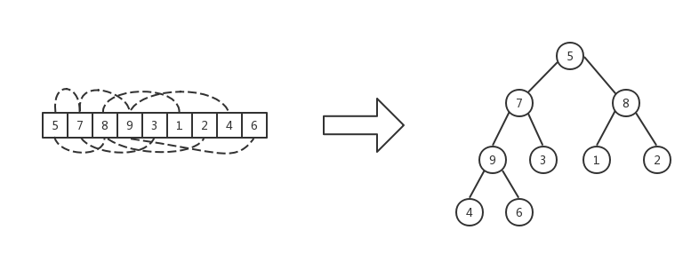
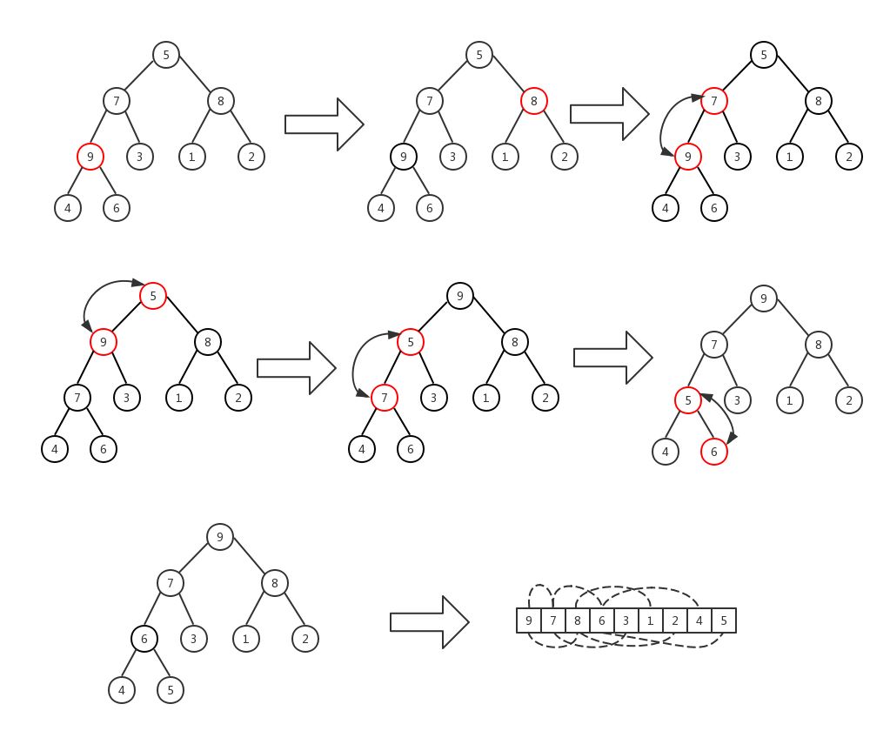
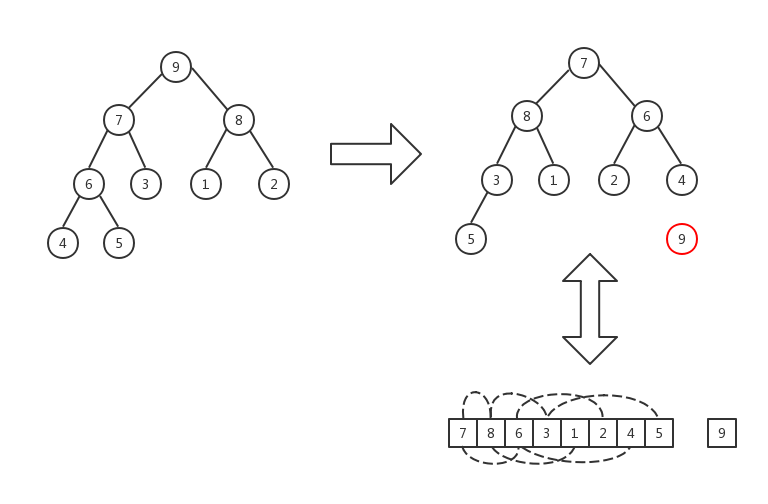

# 堆排序算法

## 算法核心思想

- **首先将数组映射为一棵完全二叉树**

  规则：对于 $i$ 下标位置的元素，它的`左孩子`下标为 $2*i+1$，`右孩子`下标为 $2*(i+1)​$.



- **维护一个以root下标为根，末尾下标为len的大根堆**

  如果root的两个孩子有比它大的，则将root和那个最大元素交换位置，并对那个子树进行`递归`维护.

```scheme
(define (MaxHeapify heap root len)
    (define (Left i) (+ (* i 2) 1))
    (define (Right i) (* (+ i 1) 2))
    (let ((left (Left root))
          (right (Right root))
          (largest root))
        (begin
            (if (and (<= left len)
                     (> (vector-ref heap left)
                        (vector-ref heap root)))
                (set! largest left))
            (if (and (<= right len)
                     (> (vector-ref heap right)
                        (vector-ref heap largest)))
                (set! largest right))
            (if (not (= largest root))
                (let ((head (vector-ref heap root)))
                    (begin
                        (vector-set! heap root (vector-ref heap largest))
                        (vector-set! heap largest head)
                        (MaxHeapify heap largest len)))))))
```

- **初始化大根堆**

  从堆中的`最后一个有孩子`的节点开始`从右向左`、`从下向上`，以每个节点为根`维护一个大根堆`.



```scheme
(define (BuildMaxHeap heap)
    (define (build-iter i)
        (if (>= i 0)
            (begin
                (MaxHeapify heap i (- (vector-length heap) 1))
                (build-iter (- i 1)))))
    (build-iter (- (div (vector-length heap) 2) 1)))
```

- **堆排序**

  从初始的大根堆开始，每次将`0下标`位置和`len下标`位置的元素交换，并$len := len-1$，然后继续对0到`len`位置的元素进行堆排序，直到$len=0$.



```scheme
(define (HeapSort heap)
    (define (sort-iter i)
        (if (>= i 1)
            (let ((max (vector-ref heap 0)))
                (begin
                    (vector-set! heap 0 (vector-ref heap i))
                    (vector-set! heap i max)
                    (MaxHeapify heap 0 (- i 1))
                    (sort-iter (- i 1))))))
    (BuildMaxHeap heap)
    (sort-iter (- (vector-length heap) 1))
    heap)
```

- [代码文件](HeapSort.scm)

